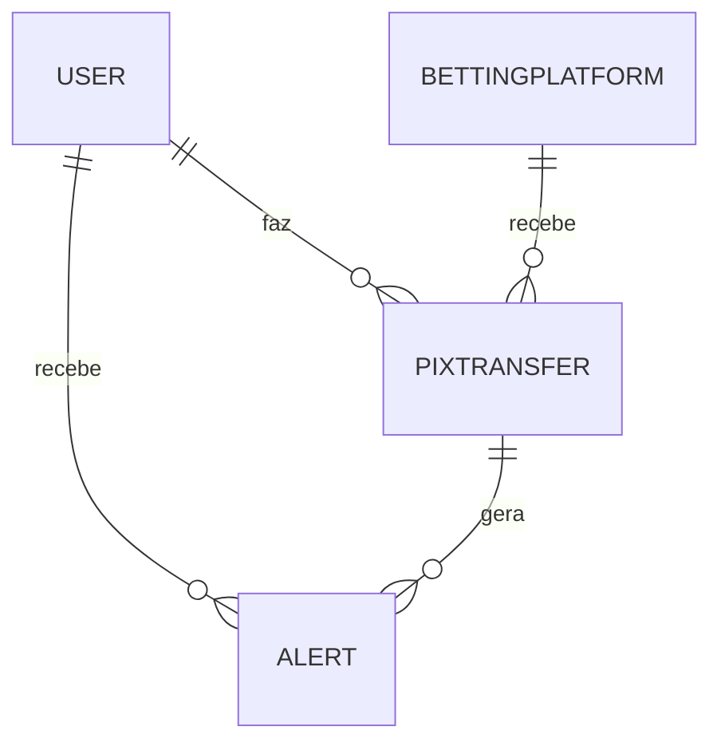

# Arquitetura

```mermaid
flowchart TD
    U[Usuário (App XP/Banking)] -->|cola Pix| API[Guardian API]
    API --> DB[(EF Core SQLite/Postgres)]
    API --> BCB[(API BCB Selic)]
    API --> LLM[(OpenAI - opcional)]
    API --> Swagger[(Swagger UI)]

    subgraph Guardian API (.NET 8)
      Controllers --> Services
      Services --> DB
      Services --> BCB
      Services --> LLM
    end
```


